# 🚀 CASO AE3-ABPRO1: GESTOR DE TAREAS V3 - ARQUITECTURA MVVM Y REACTIVIDAD

<p float="center">
  
</p>

Este proyecto es una mini aplicación nativa para Android, desarrollada en Kotlin, que tomando como base una aplicación previa (Agenda V2), la mejjora y evoluciona arquitectónicamente para adoptar el patrón _**Model-View-ViewModel (MVVM)**_. Su objetivo es ilustrar la gestión completa del ciclo de vida de una tarea de manera reactiva y eficiente, separando claramente las responsabilidades.

La presente version 3.0, refactoriza la capa de persistencia local (archivo CSV en el dispositivo), y la lógica de negocio para que sean gestionadas por el TaskViewModel y el TaskRepository, utilizando LiveData y Coroutines para notificar a la UI (Fragments) sobre cambios que ocurren en tiempo real, garantizando la persistencia, el cambio de estado, y la gestión de permisos sensibles.

**Nota**: Se reutiliza la base funcional del Caso AE2-ABPRO1 Agenda V2.

---

## 🎯 Requerimientos de Funcionalidad

1. Registrar eventos con título, descripción y fecha/hora de recordatorio.
2. Listar los eventos registrados aplicando filtros y ordenamiento sobre los datos.
3. Gestionar correctamente el ciclo de vida de Activities y Fragments.
4. Solicitar permisos sensibles (como notificaciones o calendario si es necesario) de forma segura y solo cuando se requiera.
5. Agregar y gestionar Fragments dinámicamente con paso de parámetros.
6. Implementar un RecyclerView para mostrar las tareas creadas.
7. Proporcionar feedback visual al usuario sobre los cambios de estado (por ejemplo, mediante logs o toasts).

---

## 🧠 Requerimientos Técnicos y Arquitectura MVVM

El enfoque de esta versión ha sido la adopción de la Arquitectura MVVM, que proporciona una clara _**separación de responsabilidades**_:

1. Modelo (Model) y Persistencia

   - **Modelo de Datos (Task)**: Es la clase de datos que define la estructura de una tarea.
   - **Repositorio (TaskRepository)**: Centraliza el acceso a los datos. Es responsable de la persistencia local (archivos CSV) y ejecuta todas las operaciones de I/O de forma asíncrona.

2. ViewModel (TaskViewModel)

   - Hereda de AndroidViewModel y utiliza viewModelScope para lanzar corrutinas, asegurando que las operaciones pesadas (como leer/escribir CSV) se ejecuten en el Dispatchers.IO (hilo de fondo).
   - Mantiene la lógica de negocio, manipula los datos del Repositorio y expone el estado de la aplicación a través de LiveData (ej. allTasks, statusMessage).

3. Vista (View)

   - MainActivity y Fragments (VerTareasFragment y CrearTareaFragment).
   - La Vista solo observa los LiveData expuestos por el TaskViewModel y actualiza la UI de forma reactiva, sin manipular directamente los datos ni conocer la fuente de persistencia (CSV).

4. Otros aspectos técnicos
   - Mostrar el cambio de estado de la Activity y los Fragments con Toasts.
   - Manejar la recreación de la Activity ante cambios de configuración (rotación de pantalla).
   - Crear y añadir Fragments de forma dinámica usando método de factoría (newInstance).
   - Permisos Sensibles: Se gestiona la solicitud de permisos de **"Notificaciones"** (POST_NOTIFICATIONS), se integra en el flujo de grabación de tareas mediante registerForActivityResult.
   - Implementa un Adapter personalizado para el RecyclerView.
   - Uso de bundle para pasar datos (ej. al Fragment de edición de una tarea).

## ✨ Características y Usabilidad

1.  **Arquitectura MVVM**: Implementación estricta de MVVM utilizando LiveData para la reactividad y Coroutines/viewModelScope para la gestión asíncrona de datos.
2.  **Gestión de Tareas/Eventos**: Permite registrar, modificar, marcar como completadas y eliminar eventos o recordatorios, capturando información esencial (Nombre, Descripción, Fecha, Hora, Estado, Categoría, y Alarma).
3.  **Navegación Unificada**: La lógica de navegación ha sido centralizada en la BottomNavigationView y gestionada por la MainActivity mediante transacciones de Fragments.
4.  **Persistencia Local con Repositorio**: La aplicación utiliza un archivo tareas.csv como almacenamiento persistente, gestionado internamente por el TaskRepository.
5.  **Delegación de Alarma**: La creación de recordatorios y alarmas se delega al Calendar Provider de Android mediante un Intent explícito, garantizando la funcionalidad fuera de las restricciones de la aplicación.
6.  **Permisos Seguros (Tiramisu+)**: Se solicita el permiso de Notificaciones (POST_NOTIFICATIONS) solo si el usuario activa la alarma, utilizando el contrato ActivityResultContracts.RequestPermission().

---

## 🛠️ Tecnologías usadas

- IDE: Android Studio (Narwhal 3, basado en IntelliJ IDEA)
- Plataforma: Android Nativo
- SDK mínimo: 29
- SDK Target: 36
- Kotlin: 1.9.22
- Java: 21
- Arquitectura: MVVM (Model-View-ViewModel).
- Concurrencia: Kotlin Coroutines y viewModelScope.
- Comunicación Reactiva: LiveData.
- UI/Navegación: Activity, Fragment y BottomNavigationView
- Almacenamiento: Archivos CSV (ubicados en getExternalFilesDir(null), en el dispositivo)
- APIs de Sistema: AlarmManager, CalendarContract (Calendar Provider).
- Otras tecnologías: Git, Github, Github Desktop.

---

## 💾 Estructura de Datos (CSV)

El archivo tareas.csv se compone de 8 atributos, con la siguiente estructura:

| Campo       | Descripción                                                 | Tipo de Dato |
| ----------- | ----------------------------------------------------------- | ------------ |
| ID          | UUID                                                        | String       |
| Título      | Título de la actividad                                      | String       |
| Descripción | Breve descripción                                           | String       |
| Estado      | Estado actual (Pendiente, Completada, Eliminada)            | String       |
| Fecha       | Fecha programada                                            | String       |
| Hora        | Hora programada                                             | String       |
| Categoría   | Clasificación del registro (Evento, recordatorio, Tarea)    | String       |
| Alarma      | Switch que activa o desactiva alarma recordatorio (boolean) | String       |

## 🏗️ Funcionamiento de la Aplicación

El flujo base es el siguiente:

1. Inicio y Navegación: La aplicación muestra la pantalla de bienvenida y luego la MainActivity orquesta la navegación a través de la BottomNavigationView entre VerTareasFragment (Agenda) y CrearTareaFragment.
2. Vista Agenda (VerTareasFragment):
   - Observa el taskViewModel.allTasks (LiveData).
   - Cuando el ViewModel actualiza esta lista, el RecyclerView se redibuja automáticamente (reactividad).
   - Maneja la acción de eliminar o marcar como completada, llamando a los métodos correspondientes en el ViewModel.
3. Crear/Editar Evento (CrearTareaFragment):
   - El usuario ingresa o edita los datos.
   - Al presionar "Guardar" o "Actualizar":
     - Se realiza la validación de campos obligatorios.
     - Si se requiere alarma (Notificación), se verifica/solicita el permiso de Notificaciones (POST_NOTIFICATIONS) usando registerForActivityResult.
     - Se llama a taskViewModel.saveOrUpdateTask(), que ejecuta la lógica de persistencia en el TaskRepository fuera del hilo principal.
     - La vista (Fragment) observa el taskViewModel.statusMessage para mostrar un Toast de confirmación de forma segura.
     - Finalmente, la vista navega de vuelta a la Agenda.
4. Las tareas listadas, se puede seleccionar para ser editadas.
5. Cada tarea tiene un botón eliminar que permite proceder al borrado explícito, debiendo confirmar la acción.

## Capturas de Pantalla

<p float="left">
  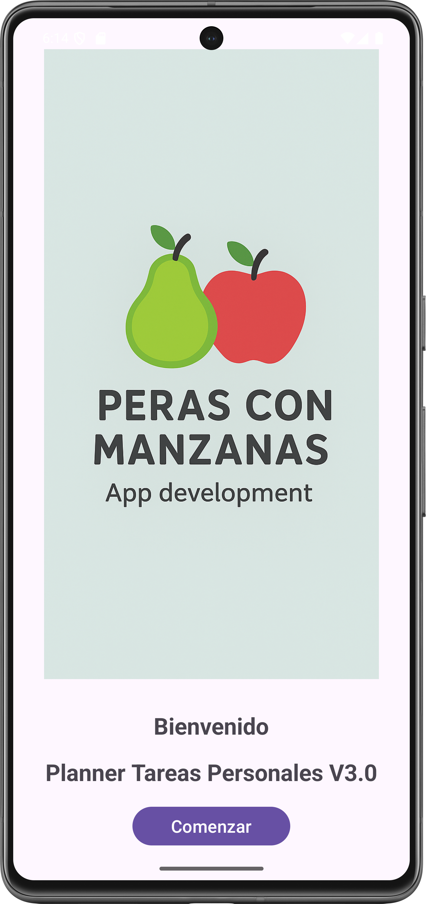  
  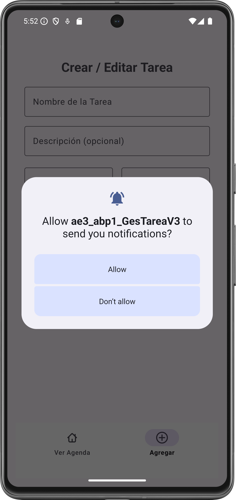
  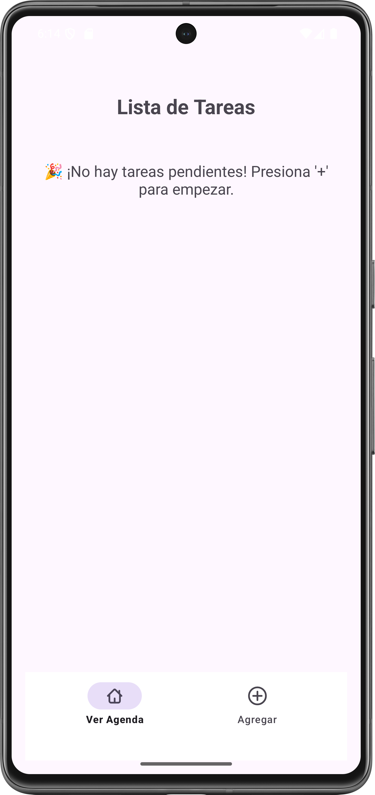
  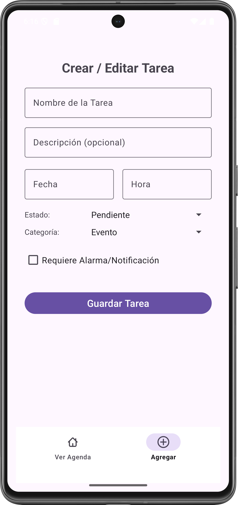
  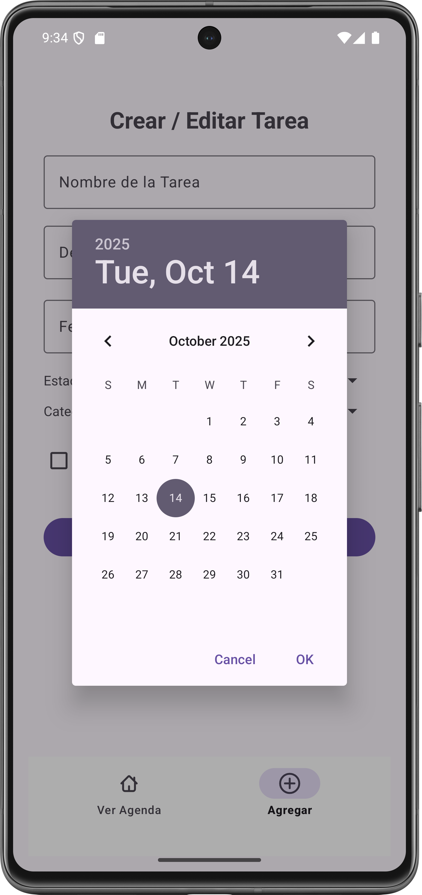
  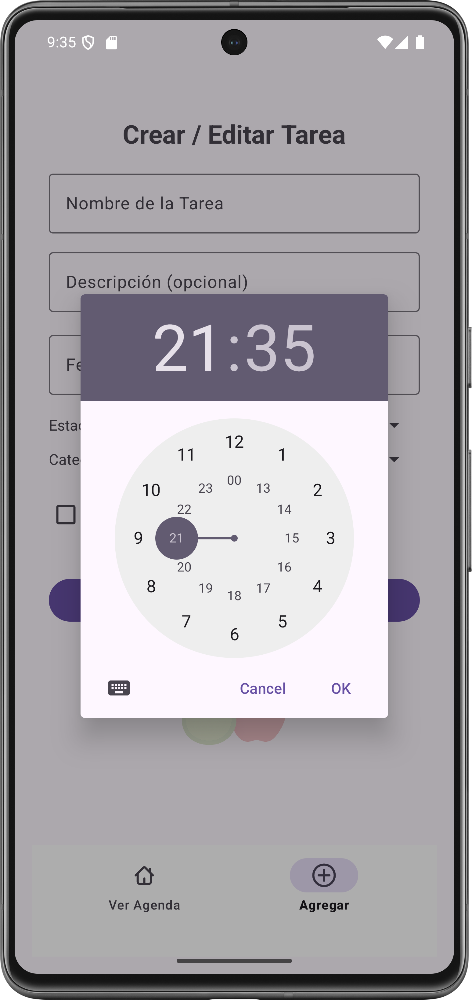  
  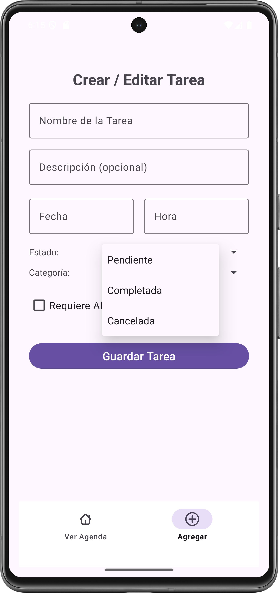
  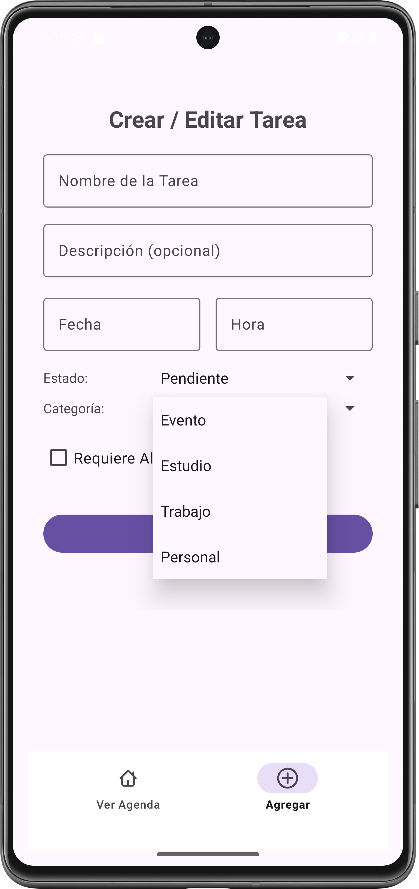
  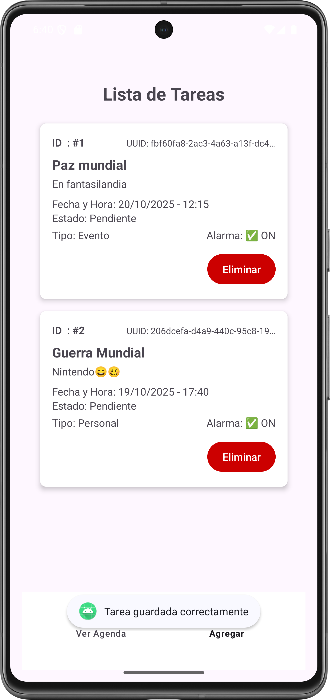
  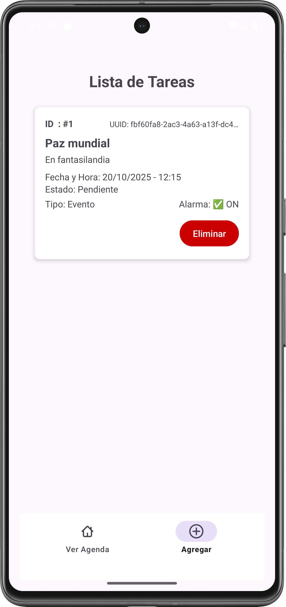
  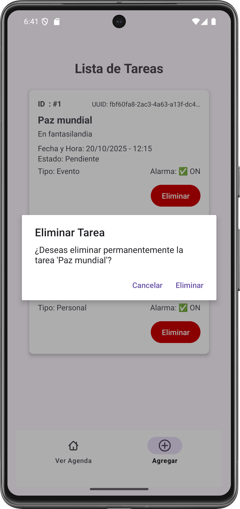
  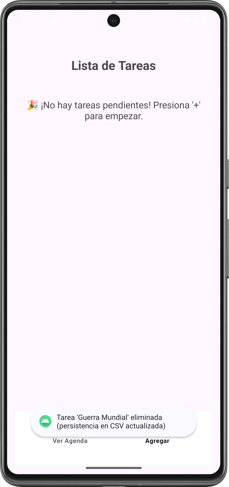  
  
</p>

## Guía de Ejecución del Proyecto

**Para ejecutar este proyecto en tu entorno de desarrollo, siga estos 'quick steps':**

1.**Clonar el Repo:** Clona el proyecto en su máquina local.

2.**Abrir en Android Studio:** Abra la carpeta del proyecto con Android Studio. El IDE detectará automáticamente la configuración de Gradle.

3.**Sincronizar Gradle:** Haz clic en el botón "Sync Now" si Android Studio te lo solicita. Esto descargará todas las dependencias necesarias.

4.**Ejecutar:** Conecta un dispositivo Android físico o inicia un emulador. Luego, haz clic en el botón "Run 'app'" (el ícono de la flecha verde) para desplegar la aplicación.

**Para ejecutar este proyecto en tu celular, sigue estos 'quick steps':**

1.**Copiar la APK:** Copia la aplicación (APK) en tu celular.

2.**Instalar:** Instala la aplicación, salta los avisos de advertencia, es normal si la aplicación no ha sido productivizada la plataforma de Android.

3.**Abrir la App:** Haz doble clic en el ícono "Agenda".

4.**Recorrer las opciones:** Cliquea en las opciones y podrás acceder al listado de eventos, editar cada evento, crear nuevos eventos, regresando a cualquier punto de la app.

## Instalación y Configuración

a. **Clonar el repositorio:**

```bash


https://github.com/jcordovaj/ae3_abp1_GesTareaV3.git


```

b. **Abrir el Proyecto en Android Studio:**

b.1. Abrir Android Studio.

b.2. En la pantalla de bienvenida, seleccionar **"Open an existing Android Studio project"** (Abrir un proyecto de Android Studio existente).

b.3. Navegar a la carpeta donde se clonó el repositorio y seleccionarla. Android Studio detectará automáticamente el proyecto de Gradle y comenzará a indexar los archivos.

c. **Sincronizar Gradle:**

c.1. Este es el paso más importante. Después de abrir el proyecto, Android Studio intentará sincronizar la configuración de Gradle. Esto significa que descargará todas las librerías, dependencias y plugins necesarios para construir la aplicación. Normalmente, una barra de progreso se mostrará en la parte inferior de la consola de Android Studio con un mensaje como **"Gradle Sync in progress"**.

c.2. Si no se inicia, o si el proceso falla, intente con el botón **"Sync Project with Gradle Files"** en la barra de herramientas. Es el icono con el **"elefante" de Gradle**. Eso forzará la sincronización.

c.3. Esperar que el proceso de sincronización termine. De haber errores, puede ser por problemas en la configuración de Android u otros conflictos, la aplicación debe descargar lo que requiera y poder ser ejecutada "AS-IS".

d. **Configurar el Dispositivo o Emulador:**

Para ejecutar la aplicación, se requiere un dispositivo Android, puedes usarse el emulador virtual o un dispositivo físico.

d.1. Emulador: En la barra de herramientas, haga click en el botón del "AVD Manager" (Android Virtual Device Manager), que es el icono de un teléfono móvil con el logo de Android. Desde ahí, puedes crear un nuevo emulador con la versión de Android que prefiera (Nota: Debe considerar que cada celular emulado, puede requerir más de 1GB de espacio en disco y recursos de memoria).

d.2. Dispositivo físico: Conecte su teléfono Android a la computadora con un cable USB (también puede ser por WI-FI). Asegúrese de que las **Opciones de desarrollador y la Depuración por USB** estén habilitadas en su dispositivo. Consulte a su fabricante para activar estas opciones.

e. **Ejecutar la aplicación:**

e.1. Seleccione el dispositivo o emulador deseado en la barra de herramientas del emulador.

e.2. Haga click en el botón "Run 'app'" (el triángulo verde en la parte superior, o vaya al menu "RUN") para iniciar la compilación y el despliegue de la aplicación, puede tardar algunos minutos, dependiendo de su computador.

e.3. Si todo ha sido configurado correctamente, la aplicación se instalará en el dispositivo y se iniciará automáticamente, mostrando la pantalla de inicio.

## Contribuciones (Things-To-Do)

Se puede contribuir reportando problemas o con nuevas ideas, por favor respetar el estilo de programación y no subir código basura. Puede utilizar: forking del repositorio, crear pull requests, etc. Toda contribución es bienvenida.

## Licencia

Proyecto con fines educativos, Licencia MIT
